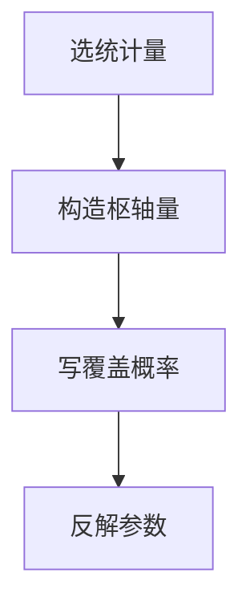

# 置信区间构造法

## 适用场景

- 需要估计值与不确定性

## 核心公式/步骤

1. 选统计量
2. 构造枢轴量
3. 写覆盖概率
4. 反解参数

## 流程图

```mermaid
flowchart TD
  N0["选统计量"]
  N1["构造枢轴量"]
  N0 --> N1
  N2["写覆盖概率"]
  N1 --> N2
  N3["反解参数"]
  N2 --> N3
```

## 典型例题

> [!example]- 示例
> 正态方差未知时用 t 枢轴量。

## 知识链接

- [[正态总体参数置信区间]]

## 习题链接

- 后续链接到对应课程习题库。
